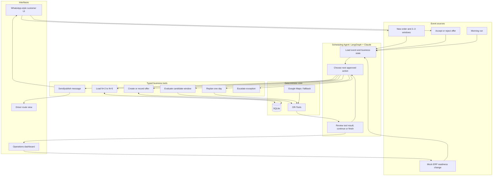

# Claude Implementation Brief: Multi-Day Agentic Delivery Planning

## Instructions for Claude

You are extending an existing hackathon prototype. Read this document and the repository README/PRD completely before changing code.

Repository:

https://github.com/Stephensaleh1601/Delivery-Schedule-Agent

Latest `main` verified when this brief was written:

```text
Commit: a3eab8f069c837830ae7edcffc815195b4043c44
Message: added whatsapp interface and google maps link
Date: 2026-08-28
```

Before implementation:

1. Fetch the latest remote state and verify whether `main` has moved beyond the commit above.
2. Confirm that the working tree is clean. If it is not clean, stop and report the existing changes rather than overwriting them.
3. Create a separate branch from the latest `main` named `feature/multiday-agentic-planning`.
4. Do not push, merge, or open a pull request unless explicitly requested.
5. Preserve existing working functionality and tests wherever possible.
6. Never commit real credentials, access keys, customer information, or a populated `.env` file.

Suggested Git flow:

```bash
git fetch origin
git checkout main
git pull --ff-only
git checkout -b feature/multiday-agentic-planning
```

If the requested branch already exists, inspect it and report the situation rather than deleting or replacing it.

---

## 1. Project context

This is an IGNITE Agentic AI Hackathon 2026 digital-track project for a Singapore bulky-furniture or home-installation delivery company.

The business problem is not merely finding the shortest route. Customers must be home, large items may require different service durations, and an agreed appointment is a promise. Coordinators currently have to balance customer availability, daily capacity, geography, route duration, and last-minute changes manually.

The upgraded product should be positioned as:

> A route-aware scheduling and delivery-recovery agent that lets customers provide several acceptable windows, chooses options that work for both the customer and the operation, protects confirmed promises, and adapts when a customer or order changes.

The customer controls when they are available. The agent chooses which customer-approved option is best for the overall delivery operation.

The project must remain a focused hackathon prototype that can be demonstrated clearly in a video of no more than five minutes.

---

## 2. Current codebase

### Current stack

- Python 3.11+
- FastAPI backend
- Plain HTML/CSS/JavaScript frontend
- SQLite persistence
- Pydantic models
- LangGraph intake and planning graphs
- Claude through Amazon Bedrock, with an optional OpenAI path
- Google OR-Tools single-vehicle routing
- Google Maps Distance Matrix, Maps JavaScript, and Directions APIs
- OneMap and haversine routing fallbacks
- pytest with a fake LLM and offline routing behaviour

### Current functionality

- WhatsApp-style customer interface.
- Rule-based booking form.
- Rule-based rescheduling flow.
- Customer chooses one exact date and time window.
- OR-Tools sequences jobs already assigned to one date.
- Admin manually selects a date and clicks **Generate Route Plan**.
- Route is displayed on a Google map.
- A Google Maps multi-stop link can be shared with the driver.
- Chat rescheduling tests whether the requested new date/window is feasible.
- Admin notifications appear when an existing route becomes stale.
- A separate LLM intake agent extracts structured jobs from free-text messages.
- A separate planning graph solves a day and drafts messages.

### Important current limitations

1. The application does not evaluate multiple future dates.
2. It does not compare N+2, N+3, N+4, and N+5.
3. The booking form assigns the customer to one date before planning.
4. There is no persistent customer-offer/acceptance workflow.
5. There is no `CONFIRMED` state with a locked appointment window.
6. The solver does not protect previously confirmed arrival windows.
7. The main `/api/route-plan` endpoint calls the solver directly and bypasses LangGraph.
8. The current planning graph is a fixed `solve -> draft_messages` pipeline, not a tool-choosing loop.
9. Rescheduling asks the customer to guess another slot rather than offering solver-tested alternatives.
10. One plan is stored per date and overwritten rather than versioned.
11. Multiple disjoint availability windows are currently collapsed into one continuous range, which could schedule a customer inside an unavailable gap.
12. The solver uses a five-second guided local search. It must not be described as guaranteed exact.
13. The displayed total-drive metric should be checked to ensure the return trip to the depot is included.

---

## 3. Target product behaviour

### Planning horizon

If today is date N, the booking agent should evaluate dates from **N+2 through N+5 inclusive**.

The horizon must be computed from an injected or configurable clock so automated tests and demo data remain deterministic. Do not hardcode the actual calendar date inside business logic.

Recommended interface:

```python
PlanningClock.today() -> date
```

For demo seeding, support an optional `DEMO_BASE_DATE` environment value. Production/default behaviour may use the system date.

### Customer availability input

The booking interface should ask the customer for:

- Customer name.
- Phone number.
- Address.
- Six-digit Singapore postal code.
- Furniture/job type.
- Two required availability options.
- One optional third availability option.
- Optional preference ranking.
- Optional willingness to accept an earlier delivery if capacity opens.

Each availability option contains:

```text
date
start time
end time
preference rank
```

Only options within N+2 to N+5 should be accepted. If the business later needs a different lead time, this range should be configurable.

If a customer supplies only one option through free text, the system may retain it but must explain that there is limited flexibility. If it is infeasible, the agent should ask for at least one more acceptable window.

### Order lifecycle

Recommended order states:

```text
PENDING_AVAILABILITY
PENDING_PLANNING
OFFERED
CONFIRMED
SEQUENCED
DISPATCHED
COMPLETED
CANCELLED
EXCEPTION
```

Suggested normal flow:

```text
PENDING_PLANNING
    -> OFFERED
    -> CONFIRMED
    -> SEQUENCED
    -> DISPATCHED
    -> COMPLETED
```

### Candidate evaluation

For every customer-provided availability option:

1. Load the current active plan and jobs for that date.
2. Create an in-memory copy of the new order using only that candidate window.
3. Treat every confirmed job as a hard constraint by using its locked window.
4. Solve the existing day without the candidate if no current plan baseline is available.
5. Solve the day with the candidate inserted.
6. Reject the candidate if no feasible route exists.
7. Calculate the incremental route cost.
8. Add penalties for opening an otherwise empty delivery day and for lower customer preference.
9. Return a typed evaluation result.

Recommended initial scoring function:

```text
score = incremental_drive_minutes
      + day_opening_penalty_minutes
      + preference_penalty_minutes
      + overtime_penalty_minutes
```

Recommended defaults, configurable in settings:

```text
day_opening_penalty_minutes = 60
preference_penalty_per_rank = 10
```

An infeasible result must never be represented by a very high score; it should have an explicit `feasible = false` state and reason.

For an empty date:

- The baseline route cost is zero.
- The proposed route includes depot -> customer -> depot.
- Apply the day-opening penalty.
- Prefer inserting into a compatible existing delivery day when possible.
- If all candidate dates are empty, retain the order as pending until the planning cut-off or offer the earliest customer-approved date according to an explicit policy.

Do not silently invent a date or time outside the customer's submitted availability.

### Customer offer

After evaluation:

- If at least two feasible candidates exist, offer the best two.
- If one feasible candidate exists, offer it alone and explain that it is the only feasible submitted option.
- If none exist, ask for additional availability or create a coordinator exception.
- Store the offer before sending it.
- The displayed reason should be customer-friendly. Do not expose internal penalties or claim that the customer's preference is operationally inconvenient.

Example customer message:

```text
We can deliver on:
1. Friday, 5 September, 9:00 am–12:00 pm
2. Thursday, 4 September, 1:00 pm–5:00 pm

Please choose the option that works best for you.
```

### Customer acceptance

When an offer is accepted:

1. Mark the offer as accepted.
2. Mark all competing offers for the same order as closed or rejected.
3. Set the order's confirmed date.
4. Store a `locked_window` equal to the accepted window.
5. Set order status to `CONFIRMED`.
6. Replan the accepted date with all locked jobs protected.
7. Save a new route-plan version.
8. Send a confirmation message.
9. Update the admin and driver views.

### Customer rejection

When an offer is rejected:

1. Record the rejection.
2. Evaluate remaining customer-approved options if they were not already evaluated.
3. Offer another feasible option if available.
4. Otherwise ask for more availability or escalate.
5. Limit the loop to two offer rounds per order for the prototype.

### Confirmed appointments

Confirmed appointments must never be silently moved.

For the initial implementation, a confirmed job can be protected by making its `locked_window` the only solver availability window. If the solver cannot produce a plan while respecting every locked window, return an exception rather than modifying a locked appointment.

### Morning planning event

The prototype should support a simulated or real `MORNING_RUN` event.

It should:

1. Finalise today's confirmed, ready jobs.
2. Exclude cancelled, delayed, and unconfirmed jobs.
3. Create/publish the latest driver route.
4. Generate reminder messages.
5. Evaluate pending N+2 orders if the planning cut-off has been reached.

For the hackathon, a **Simulate Morning Run** button may trigger the same application service that a future scheduler would call. Do not introduce production cron infrastructure unless the rest of the prototype is complete.

### Delivery-readiness disruption

To demonstrate larger business impact, support one minimal mock ERP event:

```text
ORDER_READINESS_CHANGED
ready -> delayed
```

When a confirmed delivery becomes delayed:

1. Mark the order as delayed.
2. Remove it from the executable route without deleting its history.
3. Create a new plan version for the affected day.
4. Search for ready, flexible orders that the customer has indicated may be delivered earlier.
5. Evaluate candidate replacements using the same slot-evaluation service.
6. Offer the best replacement customer an earlier slot.
7. If accepted, insert it and publish another plan version.
8. If rejected, try at most one more candidate, then escalate.

This is the business-impact demo, but it should reuse the same tools and data model rather than becoming a second architecture.

---

## 4. Agentic architecture

### Core rule

The language model chooses and explains actions. Deterministic tools validate business facts and calculate routes.

Claude must not calculate route feasibility, travel minutes, or appointment times from intuition.

### Events entering the agent

```text
NEW_ORDER
CUSTOMER_ACCEPTED_OFFER
CUSTOMER_REJECTED_OFFER
CUSTOMER_CANCELLED
MORNING_RUN
ORDER_READINESS_CHANGED
MANUAL_RETRY
```

All triggers should enter one application-level function:

```python
handle_planning_event(event: PlanningEvent) -> AgentRunResult
```

Each customer reply should create a new invocation. Do not keep an HTTP request or LangGraph execution running while waiting for a customer response.

### Recommended LangGraph state

```python
class SchedulingState(TypedDict, total=False):
    event: PlanningEvent
    order_id: str | None
    affected_date: date | None
    horizon_start: date
    horizon_end: date
    order: JobRecord | None
    candidate_evaluations: list[CandidateSlotEvaluation]
    active_offer_id: str | None
    active_plan_ids: list[str]
    last_tool_result: dict | None
    next_action: str | None
    decision_summary: str | None
    customer_message: str | None
    error: str | None
    step_count: int
    completed: bool
```

Use typed reducers only where multiple graph nodes genuinely write concurrently. A simple state update is preferable otherwise.

### Agent loop

Recommended shape:

```text
Receive event
    -> load relevant state
    -> decision node
    -> execute one approved tool
    -> observe typed tool result
    -> decision node again or finish
```

The decision node may use Claude structured output such as:

```python
class ActionDecision(BaseModel):
    action: Literal[
        "evaluate_slots",
        "create_offer",
        "lock_offer",
        "replan_day",
        "send_message",
        "find_replacement",
        "publish_plan",
        "create_exception",
        "finish",
    ]
    reason_summary: str
    arguments: dict
```

`reason_summary` is a short, user-visible operational explanation. It is not hidden chain-of-thought and should not request or expose private model reasoning.

### Guardrails

- Maintain an explicit tool allow-list.
- Validate every tool argument with Pydantic.
- Maximum six tool steps per event.
- Maximum two customer-offer rounds.
- Never execute an unknown model-selected action.
- Never move a confirmed appointment without a new accepted offer.
- Never persist an order change until the proposed result is feasible.
- Save event and plan history before publishing changes.
- Return an exception for no-solution cases.
- Use a fixed model ID from configuration and verify Bedrock region/model access.
- Record tool names, success/failure, token usage when available, and a concise decision summary.

### Approved tools

Implement tools as typed Python functions/services, not network microservices.

```text
load_order
load_planning_horizon
evaluate_candidate_slot
rank_candidate_slots
create_customer_offer
record_offer_response
lock_appointment
replan_day
find_ready_replacements
save_plan_version
send_customer_message
publish_driver_route
create_coordinator_exception
```

Some high-level tools may call lower-level deterministic services. For example, `evaluate_candidate_slot` may call the routing client and OR-Tools solver internally.

---

## 5. System architecture

The prototype should remain one deployable FastAPI application.



Do not introduce Kafka, Redis, Celery, multiple services, or a separate frontend framework for this iteration.

---

## 6. Data model and persistence

### Current persistence style

The repository stores Pydantic models as JSON in SQLite. Preserve that simple pattern unless there is a strong reason not to. The prototype does not need a production-normalised schema.

### Job model changes

The current `JobRecord.delivery_date` is mandatory. To support an unscheduled pool, change it to optional until confirmation:

```python
delivery_date: date | None = None
```

Add:

```python
availability_options: list[AvailabilityOption]
locked_window: TimeWindow | None = None
planning_status: PlanningStatus
readiness_status: ReadinessStatus
can_deliver_early: bool = False
priority: int = 0
```

Once confirmed:

- `delivery_date` is the accepted date.
- `locked_window` is the accepted time window.
- `availability` may remain for compatibility, but the solver must use `locked_window` for confirmed jobs.

### New Pydantic models

```python
class AvailabilityOption(BaseModel):
    id: str
    date: date
    window: TimeWindow
    preference_rank: int


class CandidateSlotEvaluation(BaseModel):
    availability_option_id: str
    date: date
    window: TimeWindow
    feasible: bool
    infeasible_reason: str | None
    baseline_drive_minutes: int
    proposed_drive_minutes: int
    incremental_drive_minutes: int
    day_opening_penalty_minutes: int
    preference_penalty_minutes: int
    total_score: int
    proposed_sequence: DaySequence | None


class AppointmentOffer(BaseModel):
    id: str
    order_id: str
    options: list[OfferedSlot]
    round_number: int
    status: OfferStatus
    created_at: datetime
    responded_at: datetime | None


class OfferedSlot(BaseModel):
    id: str
    availability_option_id: str
    date: date
    window: TimeWindow
    score: int


class RoutePlanVersion(BaseModel):
    id: str
    delivery_date: date
    version: int
    status: PlanStatus
    sequence: DaySequence
    reason_created: str
    parent_plan_id: str | None
    generated_at: datetime


class PlanningEvent(BaseModel):
    id: str
    event_type: PlanningEventType
    order_id: str | None
    affected_date: date | None
    payload: dict
    created_at: datetime


class AgentRunLog(BaseModel):
    id: str
    event_id: str
    actions: list[AgentActionLog]
    status: AgentRunStatus
    final_summary: str
    token_usage: dict | None
    started_at: datetime
    completed_at: datetime | None
```

### SQLite schema changes

Retain the existing tables where practical, but add:

```text
appointment_offers
route_plan_versions
planning_events
agent_runs
messages
coordinator_exceptions
```

Suggested columns follow the repository's JSON-blob convention:

```sql
CREATE TABLE appointment_offers (
    id TEXT PRIMARY KEY,
    order_id TEXT NOT NULL,
    status TEXT NOT NULL,
    data TEXT NOT NULL
);

CREATE TABLE route_plan_versions (
    id TEXT PRIMARY KEY,
    delivery_date TEXT NOT NULL,
    version INTEGER NOT NULL,
    status TEXT NOT NULL,
    data TEXT NOT NULL,
    UNIQUE(delivery_date, version)
);

CREATE TABLE planning_events (
    id TEXT PRIMARY KEY,
    event_type TEXT NOT NULL,
    created_at TEXT NOT NULL,
    data TEXT NOT NULL
);

CREATE TABLE agent_runs (
    id TEXT PRIMARY KEY,
    event_id TEXT NOT NULL,
    status TEXT NOT NULL,
    data TEXT NOT NULL
);

CREATE TABLE messages (
    id TEXT PRIMARY KEY,
    order_id TEXT,
    created_at TEXT NOT NULL,
    data TEXT NOT NULL
);

CREATE TABLE coordinator_exceptions (
    id TEXT PRIMARY KEY,
    status TEXT NOT NULL,
    created_at TEXT NOT NULL,
    data TEXT NOT NULL
);
```

The existing `day_sequences` table may remain as a compatibility/cache view of the current active plan, but route-plan history must be retained in `route_plan_versions`.

### Migration policy

Because `jobs.delivery_date` is currently `NOT NULL`, implement an explicit safe migration or introduce a versioned development database. Do not silently assume SQLite will remove the constraint.

At minimum:

1. Detect the old schema.
2. Copy existing job rows into a replacement table with nullable `delivery_date`.
3. Preserve data.
4. Swap tables in one transaction.
5. Test migration against a temporary SQLite database.

If time is severely constrained and the team agrees that seeded demo data may be recreated, document the destructive reset clearly. Do not perform a reset silently.

---

## 7. Suggested code structure

Preserve existing modules and add narrowly scoped services.

```text
dispatch_agent/
  agents/
    intake_agent.py
    planning_agent.py
    scheduling_agent.py          # new event/tool loop
    prompts.py
  planning/
    candidate_service.py         # evaluate and rank windows
    plan_service.py              # version plans and protect locks
    recovery_service.py          # delayed-order replacement flow
    tools.py                     # typed, allow-listed tool wrappers
  webapp/
    main.py
    chat.py
    jobs_service.py
  models.py
  db.py
  solver.py
```

Avoid circular dependencies between the agent graph and persistence/services. The agent should depend on tool interfaces; tools can depend on repositories and deterministic services.

### Mapping from existing files

| Existing file | Required change |
|---|---|
| `dispatch_agent/models.py` | Add availability, offers, locks, plan versions, events, agent logs, readiness states |
| `dispatch_agent/db.py` | Add repository methods and safe schema changes |
| `dispatch_agent/webapp/jobs_service.py` | Accept 2–3 availability options and nullable confirmed date |
| `dispatch_agent/webapp/chat.py` | Display generated offers, record responses, and trigger planning events |
| `dispatch_agent/webapp/static/chat.js` | Add availability option inputs and offer buttons |
| `dispatch_agent/agents/planning_agent.py` | Keep compatibility or delegate to the new scheduling workflow |
| `dispatch_agent/agents/scheduling_agent.py` | New bounded tool-choosing LangGraph graph |
| `dispatch_agent/solver.py` | Respect locked windows and return complete route metrics |
| `dispatch_agent/reschedule.py` | Use plan versions and never move confirmed jobs silently |
| `dispatch_agent/webapp/main.py` | Add event/offer endpoints and route planning through the shared service |
| `scripts/seed_test_clients.py` | Seed horizon plans, pending orders, multiple windows, and disruptions |

---

## 8. API and UI behaviour

### Suggested API endpoints

Exact naming may follow existing conventions, but support these operations:

```text
POST /api/orders
GET  /api/orders
POST /api/orders/{order_id}/plan-options
GET  /api/offers/{offer_id}
POST /api/offers/{offer_id}/respond
POST /api/events/morning-run
POST /api/orders/{order_id}/readiness
GET  /api/plans/{date}
GET  /api/plans/{date}/versions
GET  /api/agent-runs
GET  /api/exceptions
```

The WhatsApp-style UI may continue using `/api/chat`, but chat events should call the same services as the REST endpoints.

### Customer UI

Required demo states:

1. Booking form with two required and one optional availability window.
2. “We are checking your options” acknowledgement.
3. Two solver-tested offer buttons.
4. Confirmation state.
5. Rejection/alternative state.
6. Message for no feasible submitted option.

### Admin UI

Keep one dashboard and add:

- Pending-planning orders.
- Offered orders.
- Confirmed orders.
- Readiness status.
- Active plan version.
- **Simulate Morning Run**.
- **Mark Delayed** for the mock ERP event.
- Agent activity log.
- Coordinator exceptions.

Agent activity must show actual persisted event/tool results, not decorative fake steps.

Example:

```text
New order received
Loaded plans for 4–7 September
Evaluated 3 customer-approved windows
2 feasible options found
Offer sent
Customer accepted 5 September, 9:00–12:00
Plan v2 saved; 0 confirmed appointments moved
```

Do not display hidden chain-of-thought. Show only concise operational decisions and tool outcomes.

### Driver view

Reuse the existing route and Google Maps link. Show only the active published plan, including:

- Stop order.
- Customer/address.
- Arrival window.
- Job type and duration.
- Google Maps navigation link.

---

## 9. Seed data

Create deterministic data that makes the demo work without manual setup.

Recommended active data:

- One driver and one depot.
- Four-day planning horizon: N+2 through N+5.
- 4–6 existing jobs per non-empty date.
- One intentionally empty date.
- 6–8 pending orders.
- Two or three availability choices per pending order.
- At least one option that is infeasible.
- At least one option that opens an empty day.
- At least one customer who can receive an order early.
- One planned job whose readiness can be changed from ready to delayed.
- Broadly distributed Singapore addresses with one geographically obvious cluster.

Optional realism:

- Add 60–70 historical completed orders so the database contains approximately 100 total records.
- Do not put 100 active orders into a four-day, one-driver horizon.

Use a fixed seed and configurable demo base date so video behaviour is reproducible.

---

## 10. Tests

All existing tests must continue passing unless a deliberate schema/API change requires them to be updated.

Add tests for:

### Candidate planning

1. Two or three customer-approved windows are accepted.
2. Options outside N+2 to N+5 are rejected.
3. Candidate evaluation compares incremental drive time.
4. An infeasible candidate is explicitly rejected.
5. An empty day receives the opening penalty.
6. A feasible clustered day ranks above a distant or empty day when appropriate.
7. The solver does not schedule inside a gap between disjoint availability options.

### Confirmation and locks

1. Accepting an offer sets `CONFIRMED` and stores a locked window.
2. Competing offers close after acceptance.
3. Replanning cannot move a locked job outside its window.
4. An infeasible locked plan creates an exception rather than moving the customer.

### Plan versioning

1. Plan v1 remains readable after v2 is created.
2. Only one plan version per date is active/published.
3. Parent/reason fields identify why v2 was created.

### Agent behaviour

1. New-order event calls only approved tools.
2. Acceptance event locks and replans.
3. Rejection tries the next option or escalates.
4. The maximum tool-step limit is enforced.
5. No unknown action is executed.
6. FakeLLM/FakeDecisionAgent keeps tests offline and deterministic.

### Readiness recovery

1. A delayed job is excluded from the executable plan.
2. Confirmed unaffected jobs remain locked.
3. Ready replacement candidates are ranked.
4. Acceptance produces a new plan version.
5. Two failed replacement offers create an exception.

### API/UI support

1. Booking endpoint accepts multiple availability options.
2. Offer-response endpoint is idempotent.
3. Repeated customer acceptance does not create duplicate plan versions.
4. Agent activity endpoint returns persisted action summaries.

Run:

```bash
python -m pytest
```

Do not make tests depend on live Bedrock, Google Maps, or OneMap.

---

## 11. Hackathon and technical requirements

The project should visibly use the taught agentic stack:

- Claude Haiku 4.5 through Amazon Bedrock.
- `boto3` Converse/Bedrock access or the existing compatible client.
- Pydantic schemas for state and tool contracts.
- LangGraph for orchestration and feedback loops.
- Python tools for deterministic business actions.
- FastAPI and the team's own frontend.
- Local-first execution.

The solution should demonstrate:

### Planning

- Compare customer-approved windows across N+2 to N+5.
- Create route-aware offers.
- Generate/version delivery plans.

### Acting

- Persist offers.
- Send simulated WhatsApp messages.
- Lock accepted appointments.
- Publish driver routes.

### Adapting

- Respond to rejection.
- Replan after cancellation.
- Recover from a delayed order.
- Escalate when no safe option exists.

### Tool use

- The agent must call real typed tools.
- The UI should show which tools were called and their business outcomes.
- The model must not merely generate a narrative after a deterministic pipeline completes.

### Business impact

Calculate and display actual prototype metrics:

```text
Incremental drive minutes avoided
Expected deliveries recovered
Confirmed appointments moved without consent (target: 0)
Number of customers contacted
Number of coordinator interventions
Plan generation time
```

Do not invent dollar savings unless a clearly documented cost assumption is added.

---

## 12. Five-minute demo to build toward

The implementation should support this exact recorded story.

### 0:00–0:30 — Business problem

Show existing orders distributed across four future days. Explain that allowing customers to pick arbitrary slots creates inefficient routes, while one manufacturing delay can waste a delivery slot.

### 0:30–1:20 — Route-aware booking

Submit a new order with three acceptable windows. The agent loads N+2 to N+5, calls the candidate evaluator, and produces two feasible options.

### 1:20–1:50 — Confirmation

Accept one option in the WhatsApp-style UI. Show the locked appointment and a new plan version.

### 1:50–2:30 — Disruption

In the mock ERP/admin table, mark one already-planned order as delayed. Show the event reaching the agent.

### 2:30–3:20 — Recovery and feedback

The agent removes the unready job, evaluates ready replacements, and asks the best candidate whether an earlier delivery is acceptable. Reject the first offer or supply a constraint, then let the second candidate accept.

### 3:20–4:10 — Updated execution plan

Show Plan v1 versus Plan v2, the updated route map, unchanged confirmed appointments, and the driver link.

### 4:10–4:40 — Measured impact

Show values calculated from the demo:

```text
Delivery capacity recovered: 1 job
Confirmed appointments moved: 0
Customers contacted: 2
Route duration: actual before/after value
Coordinator manual replanning: not required
```

### 4:40–5:00 — Close

Position the product as an agent that makes and protects feasible delivery promises, then recovers the operation when reality changes.

---

## 13. Implementation priority

### Priority 1: must work

1. Multiple availability options in models, DB, API, and customer UI.
2. Candidate evaluation across N+2 to N+5.
3. Empty-day penalty and explicit infeasibility.
4. Customer offer and response persistence.
5. Confirmed locked window.
6. Plan versioning.
7. Tool-based LangGraph event loop with bounded steps.
8. Actual tool/action log in the admin UI.
9. Deterministic seed scenario.
10. Automated tests.

### Priority 2: business-impact demo

1. Readiness status.
2. Mock delayed-order event.
3. Find/evaluate replacement orders.
4. One rejection followed by one acceptance.
5. Plan v1/v2 impact comparison.

### Priority 3: only if everything above works

1. Real scheduler/cron integration.
2. Real WhatsApp Cloud API.
3. AgentCore deployment.
4. Multiple vehicles.
5. Live traffic refresh.
6. Learning from coordinator overrides.

Do not start Priority 3 while any Priority 1 demo path is unreliable.

---

## 14. Acceptance criteria

The branch is ready for team review when all of the following are true:

- [ ] A customer can submit two required and one optional availability window.
- [ ] The system restricts options to the configured N+2 to N+5 horizon.
- [ ] Each option is evaluated using the real deterministic routing service.
- [ ] The customer receives one or two feasible solver-tested offers.
- [ ] Accepting an offer persists a locked appointment.
- [ ] A subsequent replan cannot move that locked appointment silently.
- [ ] Route plans are versioned and the UI can show at least v1 and v2.
- [ ] The LangGraph workflow selects and calls approved tools.
- [ ] The admin activity log reflects actual persisted tool results.
- [ ] Rejection leads to another valid offer or a coordinator exception.
- [ ] The mock delayed-order event can trigger the replacement/recovery loop.
- [ ] The current Google map and driver link still work.
- [ ] No live credentials are required for tests.
- [ ] All tests pass.
- [ ] README and `.env.example` explain how to run the new flow.
- [ ] The complete scripted demo can be recorded in under five minutes.

---

## 15. Non-goals and warnings

- Do not build a complete ERP.
- Do not integrate real WhatsApp until the simulated end-to-end workflow is stable.
- Do not use an LLM to calculate routes or invent appointment availability.
- Do not allow the model to execute arbitrary Python, shell commands, URLs, or database queries.
- Do not expose chain-of-thought. Persist only high-level decisions and tool outcomes.
- Do not silently overwrite plans, confirmed slots, existing user data, or secrets.
- Do not claim the time-limited OR-Tools search is guaranteed exact.
- Do not optimise for every imaginable company. Build one reliable bulky-delivery scenario.
- Do not add infrastructure that will not appear in the five-minute demo.

---

## 16. Expected handoff from Claude

When implementation is complete, provide:

1. The branch name and final commit SHA if commits were requested.
2. A concise architecture summary.
3. A list of files changed.
4. Database migration/reset instructions.
5. Exact commands to install, seed, run, and test.
6. Test results.
7. Known limitations.
8. A step-by-step demo script using the seeded data.
9. Screens/endpoints that the human team should verify manually.

Do not claim completion if the central booking -> offer -> acceptance -> locked plan path has not been exercised end to end.
