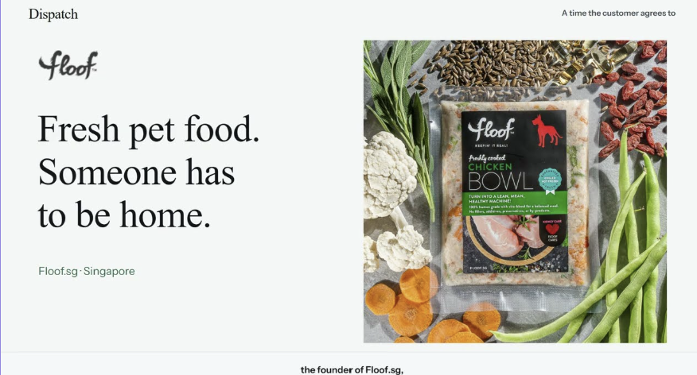
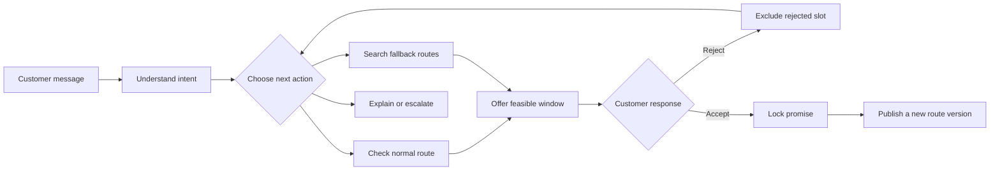
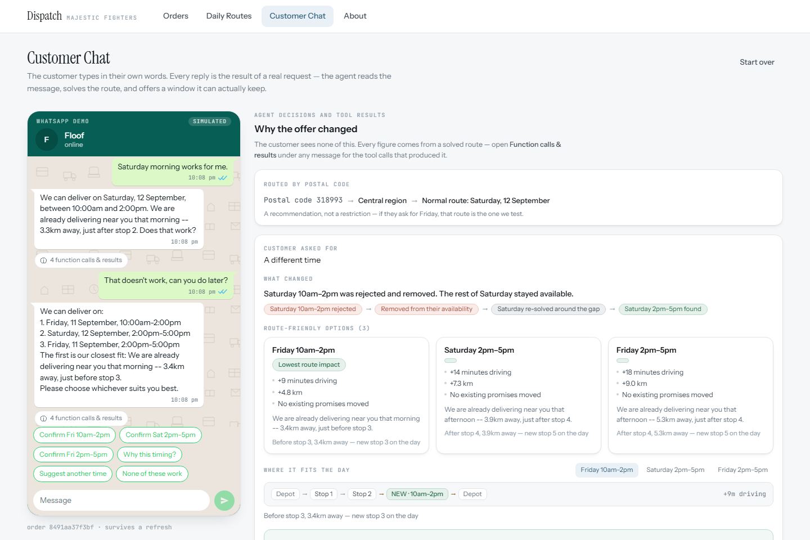
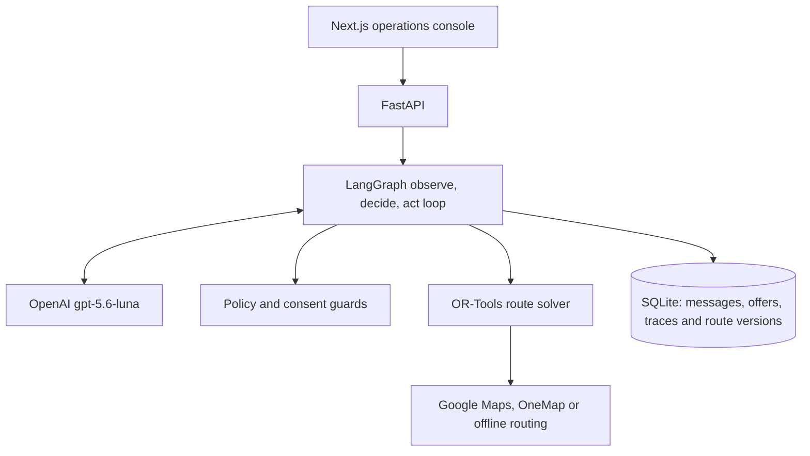

# Dispatch

**An AI delivery coordinator that agrees a time with each customer, checks the
published route before making the promise and replans when the customer says no.**

Built by **Team Majestic Fighters** for the IGNITE Agentic AI Hackathon 2026,
Digital AI track, with **Floof.sg** as the real client use case for attended
fresh-pet-food delivery.

[](https://github.com/Stephensaleh1601/Delivery-Schedule-Agent/actions/workflows/ci.yml)

[Watch the demo](https://youtu.be/IVFSnU6MvtM) ·
[Deck](submission/Dispatch-IGNITE-Hackathon-Deck.pptx) ·
[Architecture](#architecture) · [Guardrails & tests](#guardrails-and-tests) ·
[Rubric evidence](#rubric-evidence) · [Run it](#run-it)

[](https://youtu.be/IVFSnU6MvtM)

[**Watch the 3-minute demo →**](https://youtu.be/IVFSnU6MvtM)

## The problem

In our 5 September interview, Floof.sg described busy days of roughly **30-40
attended deliveries**. Route drawing was not the bottleneck. The hard part was
consolidating customer replies into booking times, by hand, over WhatsApp.

Google Maps can order known stops. A calendar can store appointments. Neither can
talk to a customer, react to a rejection, check which routes remain feasible,
ask for consent and then publish the accepted promise into a new route version.

Dispatch handles that loop:

1. A customer says when they are home in ordinary language.
2. The agent checks the relevant published route and offers a feasible window.
3. If the customer rejects it, that choice is excluded and the agent searches
   again.
4. If the customer accepts, the promise is locked and the day is republished
   without moving anyone already confirmed.

## What makes it agentic

The optimiser calculates. The agent owns the changing conversation around it.



The model is used where language and judgement matter. Deterministic code owns
dates, distance, policy, consent and route truth.

| Part | Responsibility |
|---|---|
| Language model | Understands free text, chooses the next permitted action and writes the reply |
| State gate | Exposes only tools that are legal for the current intent and booking state |
| Policy knowledge base | Supplies fixed delivery-day, time-window, attendance and escalation rules |
| Route tools | Calculate insertion positions, detours and time feasibility |
| Database | Persists messages, offers, tool traces, consent and every route version |

## Three moments to demo

### 1. One message becomes a safe offer

Open **Customer Chat**, enter a customer and postal code, then type:

> Saturday morning works for me.

Dispatch interprets the request, checks feasible insertion positions and offers
a window the route can keep.

### 2. A rejection changes the plan

Select **Suggest another time**. Dispatch records the rejected slot, searches
the permitted published routes and presents exactly three route-checked
alternatives. If policy cannot produce all three, it hands the case to a
coordinator instead of presenting a partial answer as complete.

### 3. Consent changes the operation

Confirm an option. The conversation locks, the route moves to a new version, the
new stop is highlighted and the panel reports that zero existing promises moved.
Refresh the page: the conversation, trace and confirmation remain.

<p align="center">
  <a href="docs/screenshots/customer-negotiation.png"></a>
</p>
<p align="center"><sub>One rejected window, three route-checked alternatives. Existing delivery promises stay fixed.</sub></p>

## Why existing tools stop short

| Existing tool | What it does | What Dispatch adds |
|---|---|---|
| Google Maps | Orders known stops | Decides which appointment can safely become a stop |
| Calendar booking | Stores a chosen slot | Offers only windows the published route can keep |
| Route optimiser | Solves a fixed input | Reacts to rejection, asks for consent and runs another planning cycle |
| Generic chatbot | Writes a reply | Uses approved tools, changes state, versions the route and leaves an audit trail |

## Rubric evidence

The official rubric gives 20% to each criterion. This table points judges to
evidence they can inspect in the repository or working demo.

| Criterion | Evidence in Dispatch |
|---|---|
| **Benefits delivered** | In the demonstrated flow, a coordinator no longer restarts the search after every customer rejection. The prototype turns one rejection into three checked alternatives, protects all 16 existing promises and hands unresolved cases to a person. Provider interfaces and a no-key offline mode make the proof of concept easy to adopt and repeat. |
| **Original / innovative idea** | Dispatch optimises the negotiation, not only the route. It combines a language-model decision loop with deterministic insertion, explicit customer consent and route versioning. The model cannot invent or reorder route results. |
| **Effectiveness** | Both required journeys run end to end: a normal cluster-day booking and a difficult customer who rejects, receives alternatives and accepts one. The accepted stop appears in plan v2 without moving an existing promise. |
| **Technical quality** | The working prototype uses a bounded LangGraph loop, typed tool inputs, intent-based tool permissions, OR-Tools, transactional writes, idempotency and persisted traces. CI currently checks 506 Python tests and four Chromium browser tests. |
| **Presentation** | The [3-minute video](https://youtu.be/IVFSnU6MvtM), [deck](submission/Dispatch-IGNITE-Hackathon-Deck.pptx), screenshots and three demo moments follow one story: problem, agent decision, route proof and measurable outcome. |

## Guardrails and tests

These are enforced in code, not left to a prompt.

| Rule | Where it is enforced | Regression evidence |
|---|---|---|
| A model cannot invent dates | `dispatch_agent/planning/language.py` | `tests/test_conversation.py` |
| Each intent exposes only legal actions | `dispatch_agent/planning/tools.py` | `tests/test_state_gate.py` |
| The loop stops after ten tool steps | `dispatch_agent/agents/scheduling_agent.py` | `tests/test_scheduling_agent.py` |
| An explanation cannot alter a booking | `dispatch_agent/planning/workflows.py` | `tests/test_browser_regressions.py` |
| Existing confirmed promises do not move | `dispatch_agent/planning/insertion.py` | `tests/test_offer_integrity.py` |
| Acceptance is idempotent and rolls back on failure | `dispatch_agent/planning/offer_service.py`, `dispatch_agent/db.py` | `tests/test_offers_and_plans.py` |
| Provider errors are redacted before persistence | `dispatch_agent/planning/tools.py` | `tests/test_offer_integrity.py` |
| A turn cannot finish with an unsent reply | `dispatch_agent/agents/scheduling_agent.py` | `tests/test_browser_regressions.py` |

## Architecture



- **gpt-5.6-luna through OpenAI** handles free-text understanding and action selection in the
  demo. Models accessed through AWS Bedrock remain configurable as an alternative provider.
- **LangGraph** runs the bounded agent loop.
- **Pydantic** validates tool calls before they reach operational state.
- **OR-Tools and deterministic insertion code** prove route feasibility. The model never invents
  route numbers.
- **Persisted per-step logs** make each action and tool result inspectable in
  the product.

## How the best insertion position is chosen

The language model does not guess where to place a customer. It calls a deterministic route tool
that tests the customer against the current published routes.

1. **Find nearby stops.** The tool measures the customer's address against every existing stop.
   Only stops within 10 km become possible anchors — nearby stops where an insertion may make
   sense.
2. **Test both sides.** For every anchor, the tool tries placing the customer immediately before
   and immediately after it. Duplicate gaps are removed so the same position is not tested twice.
3. **Calculate the real detour.** Let `P` be the previous stop, `C` the new customer and `N` the
   next stop. The tool uses this formula:

   $$
   \boxed{\Delta d = d(P,C) + d(C,N) - d(P,N)}
   $$

   In plain English:

   > **Added distance = previous to customer + customer to next − the original previous-to-next leg**

   ```text
   Before:  Previous ─────────── 4 km ───────────> Next

   After:   Previous ── 3 km ──> Customer ── 2 km ──> Next

   Added distance = 3 km + 2 km - 4 km = 1 km
   ```

   The original leg is subtracted because the driver would have travelled it anyway. This measures
   the actual extra journey, rather than only checking how close the customer is to one stop.
4. **Simulate the complete route.** A position is rejected if an existing customer would become
   late, the new arrival is outside the delivery windows, the route exceeds the working-day limit,
   or the customer already rejected that choice.
5. **Rank the valid choices.** The tool keeps one best insertion per date and delivery window. It
   ranks them by added distance, then added driving time, followed by stable date, window and
   position tie-breakers. The same inputs therefore produce the same order every time.

The difficult-customer flow returns the calculated top three. The model can explain the results,
but it cannot change their figures or reorder them. Keeping the current stop order also avoids
disrupting customers who already have confirmed deliveries.

## What the prototype proves

The seeded scenario is deliberately small enough to understand in a five-minute
judging slot:

- 16 confirmed deliveries across two published routes
- 2 waiting customers for the happy and difficult paths
- exactly 3 route-checked alternatives in a successful fallback
- immutable accepted promises
- persisted per-message tool traces
- idempotent message and acceptance handling
- rollback across offer, order, route and confirmation writes
- four Chromium demo-path tests in CI

Open **Function calls & results** under a reply to see which tool ran, what it
received and what it found. The customer sees a simple conversation; a judge can
inspect the machinery.

### Measured prototype results

These are repeatable demo and test results, not estimated production savings.

| Measure | Result | Why it matters |
|---|---:|---|
| Published starting workload | 16 confirmed stops across 2 routes | The new booking is tested against existing work |
| Demonstrated customer journeys | 2 complete paths | Covers first-offer acceptance and rejection/replanning |
| Difficult-customer alternatives | Exactly 3 | A complete choice set is calculated, or the case escalates |
| Existing promises moved after acceptance | 0 | A new booking does not break an earlier promise |
| Route history | v1 before, v2 after acceptance | Consent produces an auditable operational change |
| Automated checks | 506 Python + 4 Chromium tests | Covers rules, tools, persistence and both visible demo paths |

## Repeatable demo

The repository ships with 18 synthetic orders, two published routes and two
customer journeys so the happy, rejection and confirmation paths are immediately
reproducible. AWS Bedrock, Google Maps and OneMap remain selectable through
environment configuration; deterministic provider modes keep local runs and CI
stable when credentials are unavailable.

### What is real and what is simulated

| Real in the prototype | Simulated for the hackathon |
|---|---|
| Language-model action selection, policy lookup and bounded tool loop | WhatsApp-style customer screen |
| Insertion search, detour calculation and OR-Tools feasibility checks | Synthetic customer and route data |
| Consent, database writes, route versioning and driver dispatch action | Offline distance provider used by CI |
| Persisted messages, offers and per-step audit trace | One seeded driver per delivery day |

The remaining production work is mainly integration and operational hardening:
connect the chat API to WhatsApp, replace SQLite with a managed multi-user
database, add authentication and run a live operational pilot. The agent,
policy, insertion and consent boundaries are already separated for those
integrations.

## Run it

Requirements: Python 3.11+ and Node.js 22+.

Run all commands from the repository root. No machine-specific file paths or
global `PYTHONPATH` changes are required. Copy `.env.example` to `.env`; `.env`
is ignored by Git so credentials are not committed.

### Environment and provider options

| Variable | Purpose |
|---|---|
| `LLM_PROVIDER` | `openai`, `bedrock` or `none` for deterministic offline runs |
| `OPENAI_API_KEY`, `OPENAI_MODEL` | Required only when using OpenAI |
| `AWS_REGION`, `AWS_PROFILE`, `BEDROCK_MODEL_ID` | Required only when using AWS Bedrock |
| `ROUTING_PROVIDER`, `GOOGLE_MAPS_API_KEY` | Use `google` for road data or `haversine` for no-key local runs |
| `GEOCODING_ENABLED` | Set to `0` for the fully seeded offline demo |
| `DB_PATH` | SQLite file location; defaults to `./data/dispatch.db` |
| `DEMO_BASE_DATE` | Optional fixed date that makes a recorded demo repeatable |

For a no-key setup, use `LLM_PROVIDER=none`, `ROUTING_PROVIDER=haversine` and
`GEOCODING_ENABLED=0` in `.env`. See `.env.example` for every tuning variable.

### macOS / Linux

```bash
git clone https://github.com/Stephensaleh1601/Delivery-Schedule-Agent.git
cd Delivery-Schedule-Agent
python3 -m venv .venv
.venv/bin/python -m pip install -r requirements.txt
cp .env.example .env
.venv/bin/python scripts/seed_test_clients.py
```

Start the API:

```bash
.venv/bin/python -m uvicorn dispatch_agent.webapp.main:app --host 127.0.0.1 --port 8000
```

Start the console in a second terminal:

```bash
cd frontend
npm ci
npm run dev
```

### Windows PowerShell

```powershell
git clone https://github.com/Stephensaleh1601/Delivery-Schedule-Agent.git
cd Delivery-Schedule-Agent
python -m venv .venv
.\.venv\Scripts\python.exe -m pip install -r requirements.txt
Copy-Item .env.example .env
.\.venv\Scripts\python.exe scripts\seed_test_clients.py
```

Start the API:

```powershell
.\.venv\Scripts\python.exe -m uvicorn dispatch_agent.webapp.main:app --host 127.0.0.1 --port 8000
```

Start the console in a second terminal:

```powershell
cd frontend
npm ci
npm run dev
```

Open [http://localhost:3000/chat](http://localhost:3000/chat).

To restore the exact demo state on Windows, stop the existing API and run:

```powershell
.\scripts\demo_reset.ps1
```

This command deliberately clears the database at `DB_PATH`, reseeds the 18 demo
orders and starts the API. Do not run it against data you need to keep.

## Verify it

```powershell
.\.venv\Scripts\python.exe -m pytest -n 4 -q
cd frontend
npx tsc --noEmit
npm run build:e2e
npm run test:e2e
```

CI runs the Python suite, TypeScript check, production build and four Chromium
demo paths on every pull request.

## Repository map

| Path | Purpose |
|---|---|
| `dispatch_agent/agents/scheduling_agent.py` | Runs the LangGraph observe-decide-act loop and its ten-step cap |
| `dispatch_agent/planning/tools.py` | Registers tools, validates calls and enforces intent/state permissions |
| `dispatch_agent/planning/insertion_tools.py` | Tests and ranks safe insertion positions for normal and fallback offers |
| `dispatch_agent/planning/policy_kb.py` | Retrieves relevant rules from the delivery-policy knowledge base |
| `dispatch_agent/solver.py` | Uses OR-Tools to solve routes while respecting customer windows |
| `dispatch_agent/db.py` | Owns the SQLite schema, migrations and transactional persistence |
| `dispatch_agent/geo/` | Provides Google Maps, OneMap, caching and offline routing adapters |
| `dispatch_agent/webapp/main.py` | Starts the FastAPI application and exposes the operational API |
| `frontend/src/app/` | Implements Orders, Daily Routes, Customer Chat and the About story in Next.js |
| `knowledge/delivery-policy.md` | Human-readable operating rules retrieved by the agent |
| `scripts/seed_test_clients.py` | Builds the 18-order Friday/Saturday demo scenario |
| `scripts/demo_reset.ps1` | Safely resets that scenario and starts the Windows demo API |
| `frontend/e2e/demo.spec.ts` | Replays the visible happy and difficult customer paths in Chromium |
| `tests/` | Holds unit, integration, safety and regression tests |

## Team

**Majestic Fighters:** [Abhishek](https://github.com/abhishekvulla),
[Abel](https://github.com/abel123code) and
[Stephen](https://github.com/Stephensaleh1601).
