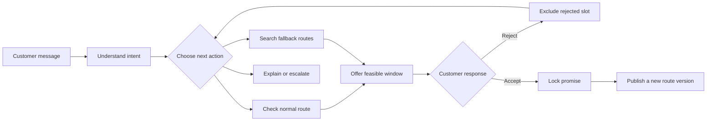
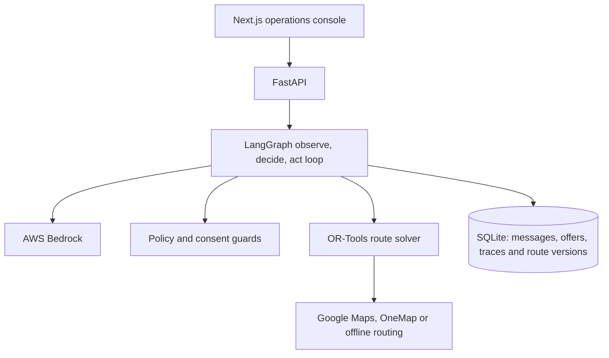

# Dispatch

**An AI delivery coordinator that agrees a time with each customer, checks the
published route before making the promise and replans when the customer says no.**

Built by **Team Majestic Fighters** for the IGNITE Agentic AI Hackathon 2026,
Digital AI track, with **Floof.sg** as the real client use case for attended
fresh-pet-food delivery.

[Watch the demo](https://youtu.be/IVFSnU6MvtM) ·
[Deck](submission/Dispatch-IGNITE-Hackathon-Deck.pptx) ·
[Architecture](#architecture) · [Guardrails & tests](#guardrails-and-tests) ·
[Run it](#run-it)

[](https://youtu.be/IVFSnU6MvtM)

[**Watch the 3-minute demo →**](https://youtu.be/IVFSnU6MvtM)

## The problem

Google Maps can order known stops. A calendar can store appointments. Neither can
talk to a customer, react to a rejection, check which routes remain feasible,
ask for consent and then publish the accepted promise into a new route version.

Dispatch handles that loop:

1. A customer says when they are home in ordinary language.
2. The agent checks the relevant published route and offers a feasible window.
3. If the customer rejects it, that choice is excluded and the agent searches
   again.
4. If the customer accepts, the promise is locked and the day is republished
   without moving anyone already confirmed.

## What makes it agentic

The optimiser calculates. The agent owns the changing conversation around it.



The model is used where language and judgement matter. Deterministic code owns
dates, distance, policy, consent and route truth.

## Three moments to demo

### 1. One message becomes a safe offer

Open **Customer Chat**, enter a customer and postal code, then type:

> Saturday morning works for me.

Dispatch interprets the request, checks feasible insertion positions and offers
a window the route can keep.

### 2. A rejection changes the plan

Select **Suggest another time**. Dispatch records the rejected slot, searches
the permitted published routes and presents exactly three route-checked
alternatives. If policy cannot produce all three, it hands the case to a
coordinator instead of presenting a partial answer as complete.

### 3. Consent changes the operation

Confirm an option. The conversation locks, the route moves to a new version, the
new stop is highlighted and the panel reports that zero existing promises moved.
Refresh the page: the conversation, trace and confirmation remain.

<p align="center">
  <a href="docs/screenshots/customer-negotiation.png"></a>
</p>
<p align="center"><sub>One rejected window, three route-checked alternatives. Existing delivery promises stay fixed.</sub></p>

## Why existing tools stop short

| Existing tool | What it does | What Dispatch adds |
|---|---|---|
| Google Maps | Orders known stops | Decides which appointment can safely become a stop |
| Calendar booking | Stores a chosen slot | Offers only windows the published route can keep |
| Route optimiser | Solves a fixed input | Reacts to rejection, asks for consent and runs another planning cycle |
| Generic chatbot | Writes a reply | Uses approved tools, changes state, versions the route and leaves an audit trail |

## Guardrails and tests

These are enforced in code, not left to a prompt.

| Rule | Where it is enforced | Regression evidence |
|---|---|---|
| A model cannot invent dates | `dispatch_agent/planning/language.py` | `tests/test_conversation.py` |
| Each intent exposes only legal actions | `dispatch_agent/planning/tools.py` | `tests/test_state_gate.py` |
| The loop stops after ten tool steps | `dispatch_agent/agents/scheduling_agent.py` | `tests/test_scheduling_agent.py` |
| An explanation cannot alter a booking | `dispatch_agent/planning/workflows.py` | `tests/test_browser_regressions.py` |
| Existing confirmed promises do not move | `dispatch_agent/planning/insertion.py` | `tests/test_offer_integrity.py` |
| Acceptance is idempotent and rolls back on failure | `dispatch_agent/planning/offer_service.py`, `dispatch_agent/db.py` | `tests/test_offers_and_plans.py` |
| Provider errors are redacted before persistence | `dispatch_agent/planning/tools.py` | `tests/test_offer_integrity.py` |
| A turn cannot finish with an unsent reply | `dispatch_agent/agents/scheduling_agent.py` | `tests/test_browser_regressions.py` |

## Architecture



- **AWS Bedrock** handles free-text understanding and action selection.
- **LangGraph** runs the bounded agent loop.
- **Pydantic** validates tool calls before they reach operational state.
- **OR-Tools** proves route feasibility. The model never invents route numbers.
- **Persisted per-step logs** make each action and tool result inspectable in
  the product.

## What the prototype proves

The seeded scenario is deliberately small enough to understand in a five-minute
judging slot:

- 16 confirmed deliveries across two published routes
- 2 waiting customers for the happy and difficult paths
- exactly 3 route-checked alternatives in a successful fallback
- immutable accepted promises
- persisted per-message tool traces
- idempotent message and acceptance handling
- rollback across offer, order, route and confirmation writes
- four Chromium demo-path tests in CI

Open **Function calls & results** under a reply to see which tool ran, what it
received and what it found. The customer sees a simple conversation; a judge can
inspect the machinery.

## Repeatable demo

The repository ships with 18 synthetic orders, two published routes and two
customer journeys so the happy, rejection and confirmation paths are immediately
reproducible. AWS Bedrock, Google Maps and OneMap remain selectable through
environment configuration; deterministic provider modes keep local runs and CI
stable when credentials are unavailable.

## Run it

Requirements: Python 3.11+ and Node.js 22+.

### macOS / Linux

```bash
git clone https://github.com/Stephensaleh1601/Delivery-Schedule-Agent.git
cd Delivery-Schedule-Agent
python3 -m venv .venv
.venv/bin/python -m pip install -r requirements.txt
cp .env.example .env
.venv/bin/python scripts/seed_test_clients.py
```

Start the API:

```bash
.venv/bin/python -m uvicorn dispatch_agent.webapp.main:app --host 127.0.0.1 --port 8000
```

Start the console in a second terminal:

```bash
cd frontend
npm ci
npm run dev
```

### Windows PowerShell

```powershell
git clone https://github.com/Stephensaleh1601/Delivery-Schedule-Agent.git
cd Delivery-Schedule-Agent
python -m venv .venv
.\.venv\Scripts\python.exe -m pip install -r requirements.txt
Copy-Item .env.example .env
.\.venv\Scripts\python.exe scripts\seed_test_clients.py
```

Start the API:

```powershell
.\.venv\Scripts\python.exe -m uvicorn dispatch_agent.webapp.main:app --host 127.0.0.1 --port 8000
```

Start the console in a second terminal:

```powershell
cd frontend
npm ci
npm run dev
```

Open [http://localhost:3000/chat](http://localhost:3000/chat).

For a fully offline demo, set `LLM_PROVIDER=none`,
`ROUTING_PROVIDER=haversine` and `GEOCODING_ENABLED=0`. Dispatch follows the
same bounded workflow without calling a paid provider.

## Verify it

```powershell
.\.venv\Scripts\python.exe -m pytest -n 4 -q
cd frontend
npx tsc --noEmit
npm run build:e2e
npm run test:e2e
```

CI runs the Python suite, TypeScript check, production build and four Chromium
demo paths on every pull request.

## Judging criteria

| Criterion | Where to look |
|---|---|
| **Benefits** | The before-and-after on slide 7 and the persisted booking outcome |
| **Innovation** | The rejection and consent loop around deterministic route optimisation |
| **Effectiveness** | Happy and difficult customer paths over the real API |
| **Technical quality** | The bounded LangGraph loop, guardrails, rollback, idempotency and CI |
| **Presentation** | The seven-slide About story and the [3-minute demo](https://youtu.be/IVFSnU6MvtM) |

## Repository map

```text
dispatch_agent/
  agents/       LangGraph loop, message understanding and progress traces
  planning/     Offers, insertion search, policy, consent and route versions
  geo/          Geocoding and routing providers
  webapp/       FastAPI endpoints
frontend/       Next.js operations console and Playwright demo-path tests
knowledge/      Delivery policy used by the agent
scripts/        Deterministic demo seed and test server
tests/          Unit, integration and regression suite
```

## Team

**Majestic Fighters:** [Abhishek](https://github.com/abhishekvulla),
[Abel](https://github.com/abel123code) and
[Stephen](https://github.com/Stephensaleh1601).
