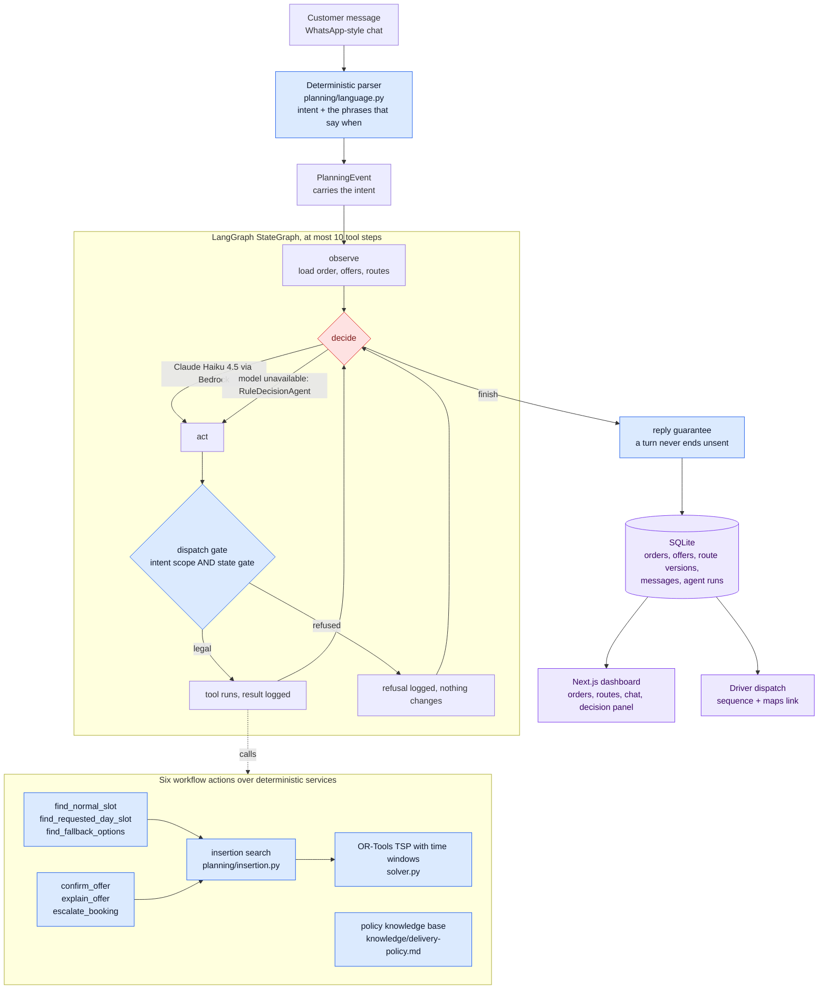

<h1 align="center">Delivery Schedule Agent</h1>

<p align="center">
  A customer texts when they are free. The agent finds where they fit on the day's real route, offers one window it can keep, explains why when asked, negotiates when it has to, and locks the promise without moving anyone already booked.
</p>

<p align="center">
  <a href="#what-it-does">What it does</a> &middot;
  <a href="#run-it">Run it</a> &middot;
  <a href="#how-it-works">How it works</a> &middot;
  <a href="#engineering-decisions">Engineering decisions</a> &middot;
  <a href="#what-is-real-and-what-is-demo">Real vs demo</a> &middot;
  <a href="#judging-criteria">Judging criteria</a> &middot;
  <a href="#repo-map">Repo map</a> &middot;
  <a href="#tests">Tests</a>
</p>

Built for the IGNITE Agentic AI Hackathon 2026, digital track, around a Singapore pet-food delivery operator with one van, two delivery days a week, and a coordinator who spends most of a working day on WhatsApp working out when each customer is home. The scheduling is not the hard part. The negotiation is.

## What it does

The coordinator's job, done by an agent, with the coordinator still in charge of the route.

**A customer says when they are free.** "Friday morning works for me." The agent reads that, looks at the route the van is already running on that customer's delivery day, finds the stop it can be inserted after, and answers with a window it can actually keep:

> We can deliver on Saturday, 5 September, between 2:00pm and 5:00pm. We are already delivering near you that afternoon -- 4.1km away, just after stop 5. Does that work?

**A customer asks why.** "Why are you suggesting this time?" The answer is read off the solved route, not written by a model: how far the nearest stop is, how much driving the visit adds, and that nobody already promised a time gets moved. A question never changes a booking; the tool that answers it is the only one the agent is allowed to call on that turn.

**A customer says no.** The agent records the refusal, searches both delivery days around what they turned down, and offers exactly three alternatives. If none of them works, a coordinator takes over and the customer is told so. It never loops.

**A customer says yes.** The slot is locked, the day's route is republished as a new version, and the old version stays readable. The driver gets the sequence and a maps link.

**Every reply names the rule behind it.** The dashboard's decision panel shows what the customer asked, which tools ran, what changed, and which delivery-policy rule applied.

## Run it

Python 3.12 and Node 22. Two terminals.

```powershell
# once
python -m venv .venv
.\.venv\Scripts\python.exe -m pip install -r requirements.txt
cd frontend; npm install; cd ..
copy .env.example .env          # fill in what you have; everything has an offline fallback
.\.venv\Scripts\python.exe scripts\reset_demo.py --yes   # seeded orders and two published routes

# terminal 1: backend
.\.venv\Scripts\python.exe -m uvicorn dispatch_agent.webapp.main:app --reload --host 127.0.0.1 --port 8000

# terminal 2: dashboard
cd frontend; npm run dev
```

Then open [localhost:3000](http://localhost:3000). Orders, Daily Routes, Customer Chat and the About deck are in the top bar. The Next.js app proxies `/api/*` to the backend, so nothing else needs configuring.

**Without any credentials it still runs end to end.** `LLM_PROVIDER=none` makes the agent use its deterministic fallback decider and `ROUTING_PROVIDER=haversine` uses straight-line estimates. That is also how the test suite runs, on purpose.

**With credentials** set `LLM_PROVIDER=bedrock` and an AWS profile or key pair for Claude Haiku 4.5 (or `LLM_PROVIDER=openai`), and `ROUTING_PROVIDER=google` with a Distance Matrix key (or `onemap`, free). See `.env.example` for each.

## How it works



A message arrives. A deterministic parser decides what kind of turn it is (availability, accept, reject, a why-question, a policy question, unclear) and quotes the phrases that say when; it never lets a model compute a date. That intent rides on the event into a bounded LangGraph loop: observe the booking, decide the next action, act, repeat. The model chooses which of a short list of approved actions to take. It does not choose what is true. Every action passes a gate that knows both the intent (a why-question may only explain) and the state of the run (nothing can be locked until the customer accepted a slot). The tools underneath are ordinary code: an insertion search over the published route, an OR-Tools solver for the day's sequence, a policy file the agent can cite. When the model is unreachable, a rule-based decider takes the same steps and the run says so. A turn cannot end with a reply written and unsent.

## Engineering decisions

The parts worth a judge's five minutes. Each one is a rule the code enforces, not a sentence in a prompt.

<details>
<summary><strong>1. The model chooses; deterministic code decides what is true.</strong></summary>

The model's output is one of a fixed set of action names plus arguments checked by a Pydantic schema with `extra="forbid"`. Dates never come from the model. "Saturday morning" comes back as those words and `planning/language.py` resolves them against the planning clock, so a model that confidently says "next Tuesday is the 15th" has no field to put that date in. Availability is recorded by a tool that takes no windows argument; the windows arrive on the tool context from the parser. There is no path through which a model can invent a time the customer never offered.

Where: `dispatch_agent/planning/language.py`, `dispatch_agent/planning/tools.py` (`record_availability`), `tests/test_conversation.py`.
</details>

<details>
<summary><strong>2. Six actions instead of sixteen, and a scope you cannot get wrong.</strong></summary>

The conversational turns use six workflow tools, one per thing a coordinator actually does: find a slot on the customer's own day, find one on the day they named, find fallbacks on both, confirm, explain, escalate. Route scope is a property of the tool, not an argument, so there is no scope to pass and no scope to get wrong, and the tool name in the trace says which routes were searched. Each intent maps to the handful of actions it may take: `INTENT_TOOLS["explain"]` is `{explain_offer, send_message, finish}`, so a why-question cannot end in a booking whatever the model decides it wants.

Where: `dispatch_agent/planning/workflows.py`, `INTENT_TOOLS` in `dispatch_agent/planning/tools.py`, `tests/test_state_gate.py`.
</details>

<details>
<summary><strong>3. The state gate narrows, never widens.</strong></summary>

`legal_actions()` computes what the agent may do right now from the run's state: once-per-run actions disappear after they succeed, a search cannot run until the customer's stated times are written down, a fallback search cannot run until the rejection is recorded, nothing can be locked until the customer accepted a slot. The same list is what the model is shown and what `dispatch()` enforces, so an illegal action is not a temptation the prompt has to talk it out of. A bug in the gate can make the agent do less than it should. It cannot make it do something unsafe.

Where: `legal_actions` and `dispatch` in `dispatch_agent/planning/tools.py`.
</details>

<details>
<summary><strong>4. A bounded loop, with a counter it cannot argue with.</strong></summary>

`MAX_TOOL_STEPS = 10`. The loop's own step counter stops it and raises a coordinator exception; LangGraph's `recursion_limit` is set to `2 * MAX_TOOL_STEPS + 6` as a backstop. Repeating a once-per-run action is refused. Asking the same clarification three times in one run is the same duplicate-action failure and is refused the same way.

Where: `dispatch_agent/agents/scheduling_agent.py`, `ONCE_PER_RUN` in `dispatch_agent/planning/tools.py`, `tests/test_scheduling_agent.py`.
</details>

<details>
<summary><strong>5. The demo survives the model being unavailable, and says so.</strong></summary>

`RuleDecisionAgent` is a deterministic policy over the same state the model sees. When the model errors, the run falls back per step, records the error, and stamps each step with who decided it. The log says plainly that it fell back rather than pretending a model made the calls. The whole test suite runs this way: four autouse fixtures pin `LLM_PROVIDER=none`, straight-line routing, a per-test SQLite file, and a blocked network, so results never drift with a provider.

Where: `RuleDecisionAgent` in `dispatch_agent/agents/scheduling_agent.py`, `tests/conftest.py`.
</details>

<details>
<summary><strong>6. Locked promises never move.</strong></summary>

Inserting a new customer into a route is only allowed where every stop already promised a window still arrives inside it. The insertion search returns options ranked by added distance; the option list is the agent's evidence, and the explanation a customer gets is read off that evidence, not generated. The dashboard's "Customers moved" counter is the number of confirmed windows changed without asking, and it is meant to read zero.

Where: `dispatch_agent/planning/insertion.py`, `dispatch_agent/planning/plan_service.py`, `tests/test_offer_integrity.py`.
</details>

<details>
<summary><strong>7. One day, one region.</strong></summary>

The operator runs one van. Friday covers North, North-East, South and East; Saturday covers Central, City and West. A customer's postal code decides their normal day, and the "normal slot" search only looks there. Only a rejection opens the other day, and only for the fallback search. The coordinator's rule, written down once, enforced at the tool.

Where: `dispatch_agent/planning/clusters.py`, `knowledge/delivery-policy.md`, `tests/test_cluster_routing.py`.
</details>

<details>
<summary><strong>8. A turn never ends unsent.</strong></summary>

The worst failure a conversation can have is the agent writing a reply, logging that it wrote it, and stopping. It happened once in a real browser session. Now the controller checks, at the end of every run, that anything written for the customer was sent, and sends it if not, with the trace saying the completion guarantee did it.

Where: `_guarantee_a_reply` in `dispatch_agent/agents/scheduling_agent.py`, `tests/test_browser_regressions.py`.
</details>

## What is real and what is demo

| | Real | Demo stand-in |
|---|---|---|
| Customer channel | The conversation logic, message log, intent handling | A web chat styled like WhatsApp. No WhatsApp API is connected. |
| Language model | Claude Haiku 4.5 on Bedrock, or OpenAI, chooses actions | Without credentials, `RuleDecisionAgent` chooses; every run records which one did |
| Drive times | Google Distance Matrix, or OneMap, with a filter for routes that stray into Johor | `haversine` straight-line estimates when no provider is configured |
| Orders and routes | The insertion search, offers, locks, route versions, driver dispatch | Twenty seeded orders and two pre-published routes from `scripts/reset_demo.py`; the calendar is pinned by `DEMO_BASE_DATE` |
| Delivery policy | A markdown policy the agent searches and cites | Written for the demo operator; edit `knowledge/delivery-policy.md` |
| Fleet | One van, two delivery days, region-by-day rule | Multi-vehicle is not built |
| Deployment | Runs locally as two processes | Not deployed to AgentCore or anywhere else |

`dispatch_agent/webapp/static/` and `webapp/chat.py` are an earlier rule-based prototype still served at `/` and `/admin`. The demo does not use them.

## Judging criteria

| Criterion | Where to look |
|---|---|
| **Effectiveness** | A stated availability becomes a kept promise in one turn. A why-question is answered from the route. A refusal gets exactly three alternatives or a human. `tests/test_chat_api.py` walks each of these over HTTP. |
| **Originality** | The agent negotiates against a real route instead of scheduling into a calendar, and answers "why that time?" with measured figures. Nobody already promised a time is moved. |
| **Technical quality** | Decisions 1 to 8 above. LangGraph loop, intent and state gates, deterministic dates, per-step fallback with provenance, offline test suite. |
| **Benefits** | The coordinator's WhatsApp day becomes a review of exceptions. The driver gets a sequence that was solved, not remembered. |
| **Presentation** | The About deck at `/about` in the dashboard is the ten slides; `slides.md` is the same content in text. |

## Repo map

```
dispatch_agent/
  agents/
    scheduling_agent.py   the bounded LangGraph loop; LLM decider, rule fallback, reply guarantee
    understanding.py      reading a message with the model, falling back honestly when unavailable
    prompts.py            the prompt text the model sees, including the action list
    progress.py           what the agent is doing right now, for the chat's progress strip
    intake_agent.py       earlier LangGraph graph: free text -> geocoded job record
    planning_agent.py     earlier LangGraph graph: a day's jobs -> a sequenced route
  planning/
    language.py           deterministic parser: intent, dates, times, from the customer's own words
    tools.py              the only actions the agent may take; INTENT_TOOLS; the state gate; dispatch()
    workflows.py          the six workflow actions, one per thing a coordinator does
    insertion.py          where a new customer fits into a published route without moving anyone
    insertion_tools.py    the tools that let the agent see the routes without inventing anything
    negotiation.py        when to counteroffer, and what to offer instead
    negotiation_tools.py  explain, clarify, and the other conversational tools
    offer_service.py      offering slots, and turning an acceptance into a locked appointment
    plan_service.py       publishing route versions and keeping the promises inside them
    clusters.py           which day a postal code belongs to; which routes a search may look at
    clock.py              the one place "today" is decided
    policy_kb.py          searching the written delivery policy so an answer can cite its rule
    decision_record.py    the decision in the shape the dashboard panel shows
    conversation.py       one customer message, handled end to end
  geo/                    postal-code geocoding, drive-time client with Johor filter, matrix cache
  solver.py               single-vehicle TSP with time windows, OR-Tools, 5s limit
  models.py               the Pydantic schemas everything shares
  db.py                   SQLite: jobs, offers, route versions, messages, agent runs
  config.py               every tunable, from the environment
  webapp/
    main.py               FastAPI app and the JSON API
    chat_api.py           one typed message in, one agent run out
    jobs_service.py       job creation and editing shared by the API routes
frontend/                 Next.js dashboard: Orders, Daily Routes, Customer Chat, About deck
knowledge/delivery-policy.md   the rules the agent cites, with the code site that enforces each
scripts/reset_demo.py     rebuild the demo database
tests/                    offline by construction; see below
```

Tunables live in `dispatch_agent/config.py`: the 10 km anchor radius for "near you", the 15-minute saving that justifies a counteroffer, the 120-minute promise window, the 5-second solver limit.

## Tests

```powershell
.\.venv\Scripts\python.exe -m pytest -q                       # everything
.\.venv\Scripts\python.exe -m pytest -q tests\test_chat_api.py  # one file; most files run in under a minute
```

The suite is offline by construction. `tests/conftest.py` pins the LLM provider to none, routing to straight-line, the database to a per-test file, and blocks outbound requests, so a test that needs the internet fails rather than passing on someone's credentials. `tests/test_state_gate.py` and `tests/test_scheduling_agent.py` are the guardrails: what happens when the model asks for something it should not. `tests/test_chat_api.py` walks the conversation over HTTP. `tests/test_browser_regressions.py` holds failures found in real browser sessions, each written so it fails if the fix is removed.
