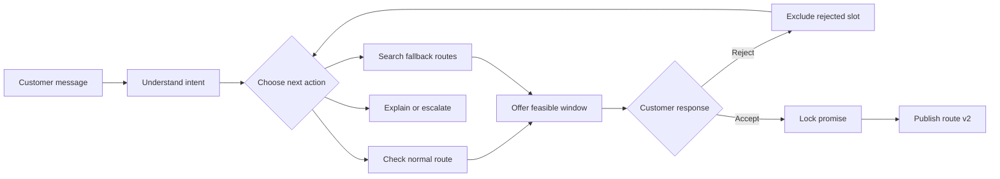

# Dispatch

**An AI delivery coordinator that agrees a time with each customer, checks the real route before
making the promise, and replans when the customer says no.**

Built by **Team Majestic Fighters** for the IGNITE Agentic AI Hackathon 2026. The use case was
informed by an interview with Floof.sg, where fresh food cannot simply be left outside and staff
must coordinate a recipient window.

[Open the 10-slide hackathon deck](submission/Dispatch-IGNITE-Hackathon-Deck.pptx).

## The 10-second version

Google Maps can order stops. A calendar can store appointments. Neither can hold a conversation,
understand a rejection, decide which routes are still feasible, ask for consent, then lock the
accepted promise into a new route version.

Dispatch does that loop:

1. A customer says when they are home in ordinary language.
2. The agent checks the relevant published route and offers only a feasible window.
3. If the customer rejects it, the agent excludes that choice, searches both routes and returns
   three ranked alternatives.
4. When the customer accepts, Dispatch locks the promise and republishes the day without moving
   anyone already confirmed.

## Three moments to demo

### 1. One sentence becomes a safe offer

Open **Customer Chat**, enter a customer and postal code, then type:

> Saturday morning works for me.

The agent interprets the request, chooses a bounded workflow, evaluates insertion positions and
offers a window the route can keep.

### 2. “No” triggers a different plan

Select **Suggest another time**. Dispatch records the rejected slot, searches both published
routes and presents exactly three calculated alternatives. These are not LLM guesses; each option
contains route evidence and preserves every existing promise.

### 3. Consent changes the operation

Confirm the second option. The chat locks, the route moves from v1 to v2, the new stop is
highlighted and the impact panel shows that zero existing promises moved. Refresh the page: the
conversation, trace and confirmation remain.

## Why this is agentic

The optimiser calculates. The agent owns the changing conversation around it.



The model is used where language and judgement matter. Deterministic code owns distance, policy,
time windows, consent and route truth.

## Architecture


### Sponsor-native, not logo-native

- **AWS Bedrock** reads free-text availability and drives the agent's action decisions.
- **LangGraph** runs the bounded observe → decide → act loop and records every tool result.
- **Pydantic** validates every tool call before it can reach operational state.
- **OR-Tools** proves route feasibility; the LLM never invents route numbers.
- **AgentCore** is the next deployment target for the existing Python agent runtime.

## What makes it different

| Existing tool | What it does | What Dispatch adds |
|---|---|---|
| Google Maps | Orders known stops | Decides which appointment can safely become a stop |
| Calendar booking | Stores a chosen slot | Offers only slots the live route can keep |
| Route optimiser | Solves a fixed input | Handles rejection, consent and another planning cycle |
| Generic chatbot | Writes a reply | Uses tools, changes state, versions the route and leaves an audit trail |

## Proof built into the product

The seeded scenario is intentionally small enough to understand in a five-minute judging slot:

- 16 confirmed deliveries across two published routes
- 2 waiting customers for the happy and difficult paths
- exactly 3 route-checked alternatives in the difficult path
- immutable accepted promises
- persisted per-message tool traces
- idempotent message and acceptance handling
- rollback across offer, order, route and confirmation writes
- real browser tests for both judge paths

Open **Function calls & results** under any reply to see which tool ran, what it received and what
it found. The customer sees a simple conversation; the judge can inspect the machinery.

## Run it

Requirements: Python 3.11+, Node.js 22+, and an AWS Bedrock credential for the live model path.

```powershell
git clone https://github.com/Stephensaleh1601/Delivery-Schedule-Agent.git
cd Delivery-Schedule-Agent
python -m venv .venv
.\.venv\Scripts\python.exe -m pip install -r requirements.txt
Copy-Item .env.example .env
.\.venv\Scripts\python.exe scripts\seed_test_clients.py
```

Start the API:

```powershell
.\.venv\Scripts\python.exe -m uvicorn dispatch_agent.webapp.main:app --host 127.0.0.1 --port 8000
```

Start the console in a second terminal:

```powershell
cd frontend
npm ci
npm run dev
```

Open [http://localhost:3000/chat](http://localhost:3000/chat).

For a fully offline demo, set `LLM_PROVIDER=none`, `ROUTING_PROVIDER=haversine` and
`GEOCODING_ENABLED=0`. Dispatch follows the same bounded workflow without making a paid provider
call.

## Verify it

```powershell
.\.venv\Scripts\python.exe -m pytest -n 4 -q
cd frontend
npx tsc --noEmit
npm run build:e2e
npm run test:e2e
```

CI runs the same Python, TypeScript, production-build and Chromium gates on every pull request.

## Safety invariants

- No booking without a customer-accepted offer and exact slot.
- No confirmed appointment may move during replanning.
- A route change invalidates stale offers before acceptance.
- A rejected slot cannot be offered again in the same negotiation.
- A model can call only the tools permitted for the current intent and state.
- Every run has a hard step limit and a human-escalation path.
- Provider failures degrade to the deterministic procedure.
- Secrets are redacted before errors reach persisted traces.

## Demo model

Friday/Saturday, regional clusters, service times, the 10 km anchor radius and all demo customers
are synthetic prototype assumptions. They make one repeatable coordination problem visible; they
are not presented as Floof.sg's operating policy.

## Repository map

```text
dispatch_agent/
  agents/       LangGraph loop, message understanding and progress traces
  planning/     Offers, insertion search, policy, consent and route versions
  geo/          Geocoding and routing providers
  webapp/       FastAPI endpoints
frontend/       Next.js operations console and Playwright judge-path tests
knowledge/      Delivery policy used by the agent
scripts/        Deterministic demo seed and test server
tests/          Unit, integration and regression suite
```

## Team

**Majestic Fighters** — Abhishek, Abel and Stephen.
