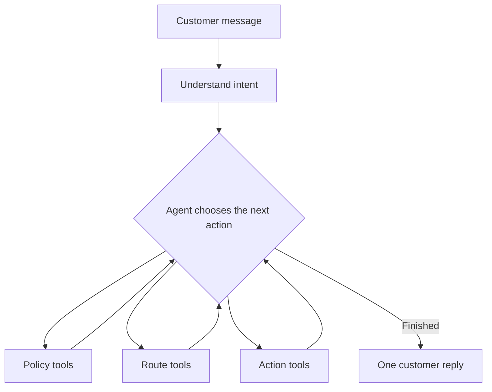

# Slide 1 — The ask

*Judging criterion: Presentation*

## Nobody should spend an afternoon asking forty people when they are home

Dispatch is an AI delivery coordinator that agrees a delivery time by text,
checks the published route and only offers windows the van can keep.

**Use case:** Floof.sg, fresh pet food delivery in Singapore

**Team:** Majestic Fighters

**Track:** IGNITE Agentic AI Hackathon 2026, Digital AI

---

# Slide 2 — The problem

*Judging criteria: Benefits and Presentation*

## Two hard jobs, both done by hand

Floof.sg coordinates attended deliveries for fresh pet food. Somebody must be
home, so each order needs a time the customer accepted.

1. **Agree a time.** Floof.sg handles 30–40 deliveries on a busy day. One
   coordinator asks customers on WhatsApp.
2. **Keep the route sensible.** Every accepted time changes where the stop can fit.

**The bottleneck:** Customer availability becomes route input. One “no” starts
another route search.

The hard part is turning changing customer answers into promises the route can
actually keep.

---

# Slide 3 — What we built

*Judging criterion: Effectiveness*

## The customer texts. The agent replies with a time it can keep.

1. The customer writes in ordinary language.
2. The agent understands the request.
3. It checks the relevant published route.
4. It offers a feasible window with route evidence.
5. A rejection excludes that choice and triggers another search.
6. An acceptance locks the promise and publishes a new route version.

**Happy path:** Mrs Chua accepts the first offer.

**Difficult path:** Mr Rajan rejects it, receives route-checked alternatives and
can be handed to a coordinator if policy cannot produce a complete set.

No booking changes without the customer’s consent.

---

# Slide 4 — How it is built

*Judging criteria: Innovation and Technical quality*

## Everything comes back to the same question: what should I do next?

The AI handles language and chooses among approved actions. Deterministic code
owns dates, distance, policy, consent and route truth. The loop is capped at ten
tool steps and every action is persisted for inspection.

---

# Slide 5 — Fitting people in

*Judging criteria: Innovation and Technical quality*

## Slide them into the day. Don’t rebuild it.

The seeded demo has two published delivery days:

- **Friday:** North, North-East, South and East
- **Saturday:** Central, City and West

For a new customer, Dispatch tests positions around nearby stops and rejects any
option that would make an existing promise late.

Four rules stay fixed:

- Existing confirmed stops keep their order.
- Existing promised windows do not move.
- The agent searches only permitted delivery days.
- It offers one normal slot, or exactly three fallbacks after a rejection.

---

# Slide 6 — The prototype

*Judging criteria: Effectiveness and Technical quality*

## It runs. Here is where.

- **Orders:** every job and its booking state
- **Daily Routes:** published route versions in visiting order
- **Customer Chat:** the conversation, tool calls and decision evidence

The customer sees a simple reply. The coordinator can inspect what the agent
read, which route it checked, what it rejected and why.

Working now: Python, FastAPI, Next.js, LangGraph, AWS Bedrock, OR-Tools and
SQLite. The demo channel and address lookup sit behind interfaces ready to
connect to the operator’s messaging and address systems.

---

# Slide 7 — What changes

*Judging criterion: Benefits*

## An afternoon of texting becomes something that answers itself

| Before | With Dispatch |
|---|---|
| A coordinator chases dozens of replies | Each customer is answered as they reply |
| A rejection starts another manual search | The agent excludes it and replans |
| Route decisions live in one person’s head | Every decision and route version is inspectable |
| Drivers reconcile appointments on the road | They receive a route built from accepted promises |

Every confirmed customer gets a time they accepted. Every driver gets a route
built from accepted promises. Unresolved cases go to the coordinator.
