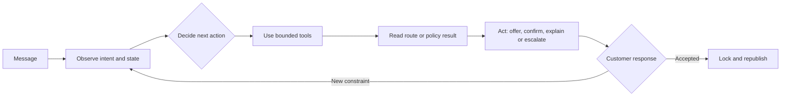
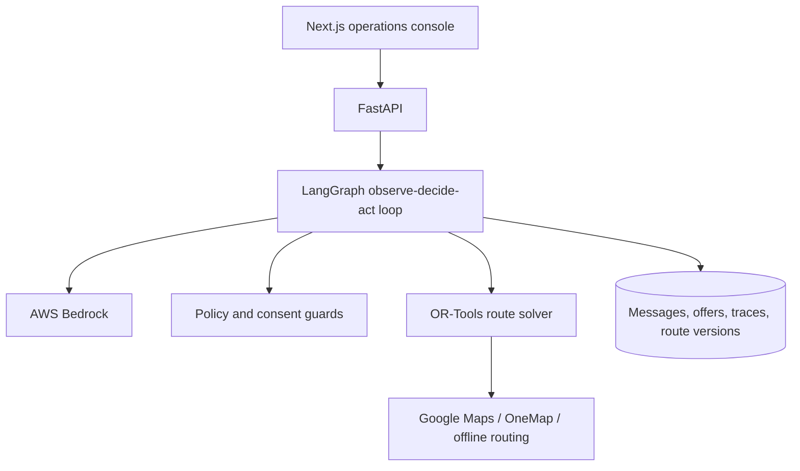

# Slide 1 — The promise

## Nobody should spend the day asking customers when they are home

**Dispatch is an AI delivery coordinator that offers only times the route can keep.**

Fresh-pet-food delivery · Singapore · Team Majestic Fighters

---

# Slide 2 — The real bottleneck

## Before route optimisation, somebody has to negotiate the stops

Informed by an interview with Floof.sg:

- roughly 30–40 deliveries can run in a day
- fresh food cannot simply be left outside
- staff message customers to find a recipient window
- those replies must then become a workable driver route

One customer saying “not then” changes the input and sends the coordinator back into the loop.

---

# Slide 3 — Why the existing tools stop short

| Tool | Useful for | Missing decision |
|---|---|---|
| WhatsApp | Getting a reply | Is the requested time operationally possible? |
| Calendar | Storing a slot | Which safe slot should we offer? |
| Google Maps | Ordering known stops | Should this customer become a stop on this route? |
| Route optimiser | Solving fixed inputs | What happens after rejection or acceptance? |

**The optimiser calculates. The agent owns the changing conversation around it.**

---

# Slide 4 — One simple customer journey

```text
Customer states availability
          ↓
Agent checks the relevant published route
          ↓
Offers one feasible window
          ↓
Customer accepts → lock promise → route v2
        or
Customer rejects → exclude slot → search again → three ranked choices
```

No customer is moved without permission. No route number comes from the LLM.

---

# Slide 5 — What makes it agentic



The agent selects a legal workflow, observes the result and acts again. Pydantic contracts, consent
guards and OR-Tools remain the source of truth.

---

# Slide 6 — Three moments judges can see

## 1. Language becomes an operation

“Saturday morning works for me” becomes a route-checked offer.

## 2. Rejection changes the plan

“That does not work” records the declined slot and produces three different, ranked alternatives.

## 3. Consent changes the route

The customer picks option two. Route v1 becomes v2, the stop is highlighted and **zero existing
promises move**.

---

# Slide 7 — Architecture



Every reply links to its persisted run. A judge can open the exact tool inputs and results that
produced it.

---

# Slide 8 — Sponsor technology is essential

| Technology | Job in Dispatch |
|---|---|
| AWS Bedrock | Understands free-text availability and chooses agent actions |
| LangGraph | Runs the bounded observe → decide → act loop |
| Pydantic | Rejects invalid or out-of-scope tool calls |
| OR-Tools | Proves whether a promise fits the route |
| Playwright + GitHub Actions | Replays both judge paths before every merge |

Next deployment step: move the existing Python agent runtime into Bedrock AgentCore.

---

# Slide 9 — Evidence, not a mock-up

- 16 confirmed synthetic deliveries across two published demo routes
- two waiting customers for the happy and difficult paths
- exactly three route-checked alternatives after rejection
- one accepted option republishes the route with zero promises moved
- concurrent retries produce one message and one run
- offer, order, route and confirmation writes roll back together
- automated Python, TypeScript, production-build and Chromium gates

The visible trace is backed by persisted tool results, not an animation.

---

# Slide 10 — The outcome

## From “when are you home?” to one route the driver can trust

For the customer: a normal conversation and a time they agreed to.

For the coordinator: fewer manual checks, no silent promise changes, and one auditable plan.

For the operation: every offered slot is route-feasible; unresolved cases reach a person.

**Dispatch negotiates the stops before the driver has to live with them.**

Team Majestic Fighters · IGNITE Agentic AI Hackathon 2026
